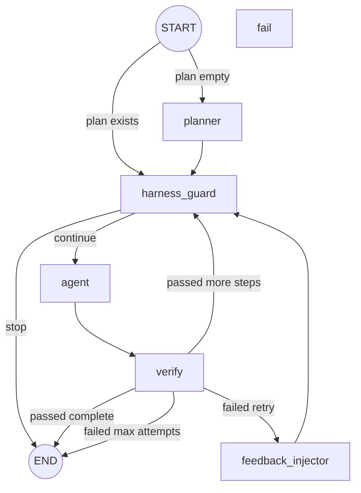

# Coding-Agent-Harness

## What this project is

`coding-agent-harness` is a harness engineering framework built first around a LangGraph coding agent, then extended to prove the same harness can generalize beyond coding tasks by swapping in a CRAG executor. It uses Python, LangGraph, LangChain, LiteLLM/gpt-4o-mini, structlog, and pytest, and currently has 61 tests covering the core harness, production hardening, and RAG integration experiment. The project evolved through three main commits: `feat: coding-agent-harness — 5-layer harness engineering demo`, `feat(v2): P1 fixes — schema guard, real cost tracking, 3-state breaker, log query`, and `feat(v2): P2 upgrades — inferential verification, async HITL, reviewer subagent, mermaid export`.

## What harness engineering is

Harness engineering is the discipline of making an agent reliable by surrounding the model with deterministic control systems: state contracts, permission gates, loop guards, verifiers, observability, and recovery paths. In this framing, Agent = Model + Harness. Prompt engineering asks a model to comply probabilistically; harness engineering constrains what can happen deterministically.

ETCLOVG taxonomy: E covers environment and sandbox boundaries. T covers tool permissioning and risk gates. C covers context management and compaction. L covers loop control and graph routing. O covers observability and audit trails. V covers verification, both computational and inferential. G covers governance instructions, policies, and human approval rules.

In the stack, prompt engineering shapes model behavior, context engineering shapes what the model sees, harness engineering shapes what the system permits and records, and loop engineering shapes how the agent retries, routes, stops, and recovers.

## Project evolution

### v1 — Foundation (25 tests)

Built all seven harness layers as a LangGraph coding agent with a PEV loop and 3 demo tasks.

- `AgentState` schema for graph state shared across plan, execute, verify, and guard nodes.
- `CircuitBreaker` 2-state implementation for stopping repeated failures.
- `PermissionResolver` with path scoping and HITL approval.
- `HarnessContextManager` with `AGENTS.md` injection and budget tracking.
- structlog dual output to JSONL and console.
- `verify_node` running pytest as computational verification.
- `AGENTS.md` and `.harness/blocked_patterns.txt` as governance inputs.

### v2 P1 — Structural fixes (38 tests)

Discovered two silent failure classes through live testing and hardened the harness contract.

- Schema guard runtime validation that caught a live bug during implementation.
- Real token and cost accounting via `usage_metadata`.
- Three-state circuit breaker: `CLOSED -> OPEN -> HALF_OPEN` with cooldown and recovery.
- Queryable log helper `get_events()` filters by type before limiting.

### v2 P2 — Capability upgrades (55 tests)

Added four production-grade features.

- Inferential verification: LLM-as-judge soft signal that never blocks task completion.
- Async HITL approval queue with file-backed atomic writes, timeout, and auto-deny.
- Reviewer subagent: genuinely isolated read-only agent with its own `PermissionResolver` and `CircuitBreaker`.
- Mermaid graph export via `to_mermaid()`.

### RAG integration experiment (61 tests)

Replaced the coding executor with a CRAG pipeline to test harness task-agnosticism.

- Minimal CRAG subgraph with in-memory retriever, document grader, `web_search` stub, and generator, all with API-key stubs.
- Wired via `build_graph(executor=rag_executor, verifier=rag_verifier)`, the same injectable pattern used by tests.
- `judge_rag_answer()` adds a RAGAs-faithfulness-style check while reusing `InferentialVerificationResult`.
- Finding: `AgentState` needed zero new top-level fields; `task`, `output`, `verification`, `harness_events`, and `budget` were sufficient.
- Two genuine gaps: token accounting is executor-coupled, and the circuit breaker has no RAG-equivalent trip signal.

## Architecture



## Setup

```bash
git clone https://github.com/RandomX707/Harness
cd Harness/coding-agent-harness
pip install -e .
cp .env.example .env
# fill in LITELLM_API_KEY and LITELLM_BASE_URL
```

All demos and tests work without API keys; the harness falls back to deterministic stubs automatically.

## Running the demos

```bash
# Clean PEV loop — harness runs to completion, no interventions
PYTHONPATH=src python3 src/main.py --task simple

# Permission resolver — blocks write to .harness/evil.txt, allows src/utils.py
PYTHONPATH=src python3 src/main.py --task permission_test

# Circuit breaker — always-failing verifier trips CIRCUIT_OPEN
PYTHONPATH=src python3 src/main.py --task doom_loop_test

# RAG executor — CRAG pipeline through the same harness loop
PYTHONPATH=src python3 src/main.py --rag

# Graph topology
PYTHONPATH=src python3 src/main.py --visualize
```

## Running the tests

```bash
PYTHONPATH=src python3 -m pytest tests/ -v
```

- `test_circuit_breaker.py` covers three-state transitions.
- `test_permission_resolver.py` covers path scoping, HITL, and async queue behavior.
- `test_pev_loop.py` covers full PEV loop integration, including the RAG executor path.
- `test_schema_guard.py` covers `AgentState` contract validation.
- `test_pricing.py` covers token cost calculation.
- `test_inferential_verifier.py` covers the LLM-as-judge soft signal.
- `test_approval_queue.py` covers the async HITL file-backed queue.
- `test_reviewer.py` covers reviewer subagent isolation.
- `test_log_query.py` covers the queryable log helper.
- `test_graph_export.py` covers Mermaid export.
- `test_rag_graph.py` covers CRAG subgraph routing.

## Key design decisions

The schema guard fires at the harness level instead of existing only as a type hint because type hints do not catch LangGraph silently dropping undeclared state keys at runtime. Runtime validation turns the state schema into an executable contract.

Inferential verification is a soft signal in the coding path because an LLM judge can be wrong, expensive, or unavailable. Letting that block completion would allow a flaky probabilistic check to override a deterministic passing test suite.

The reviewer subagent gets its own `PermissionResolver` instance instead of a config flag because isolation is stronger than denial. `write_file` is never registered for the reviewer, so there is no write path to accidentally approve.

`AgentState` uses a flat `TypedDict` instead of nested dataclasses because LangGraph works best with a flat serializable state schema. Domain-specific nested data lives inside declared fields such as `verification["rag"]`, not as undeclared top-level keys.

The RAG experiment used an injectable executor instead of a separate harness because that directly tests whether existing harness primitives work on a non-coding task with zero modifications. A parallel RAG-only harness would trivially pass while proving less about generalization.
